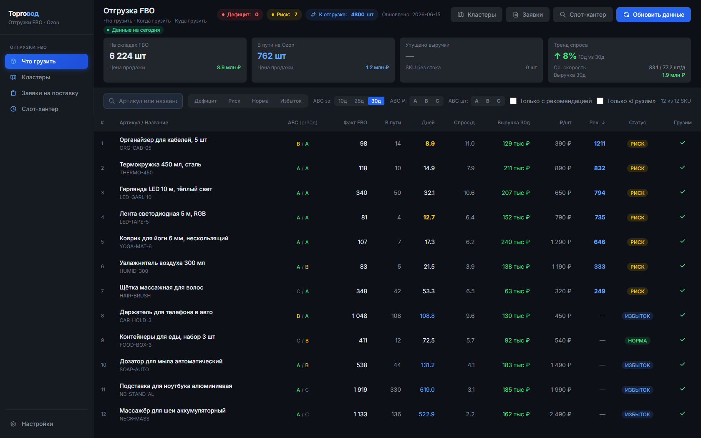
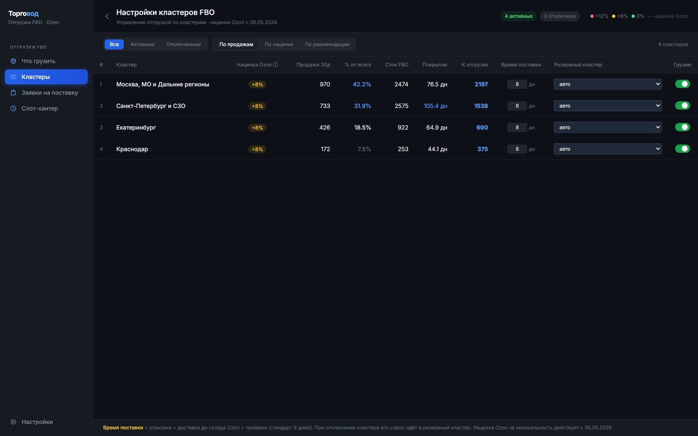
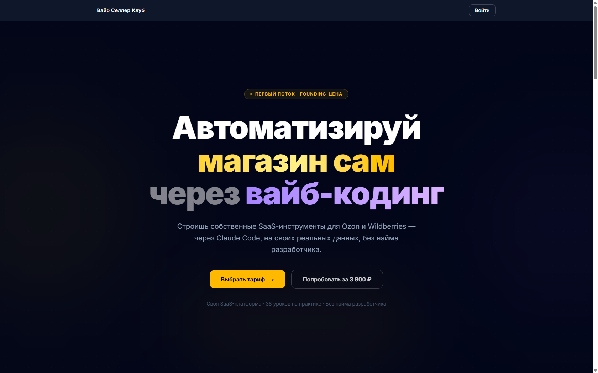

<h1 align="center">📦 Торговод · Отгрузки FBO</h1>

<p align="center">
  <b>Бесплатный инструмент, который говорит селлеру Ozon: что везти на FBO, сколько и в какой регион — чтобы не ловить дефицит и не платить за переизбыток.</b>
</p>

<p align="center">
  
  
  
  <a href="https://t.me/vibe_coding_ozon_wb"></a>
</p>

<p align="center">
  
</p>

<p align="center">
  <a href="#-запуск-за-10-минут"><b>⬇️ Скачать и запустить за 10 минут →</b></a>
</p>

---

## Кому это и зачем

Если вы продаёте на **Ozon по схеме FBO** (товар лежит на складах Ozon), то знаете две боли:

- **Дефицит** — товар закончился на складе в нужном регионе → продажи встали → теряете выручку и позиции в выдаче.
- **Переизбыток** — навезли слишком много → платите Ozon за хранение и замораживаете деньги в неликвиде.

«Торговод · Отгрузки FBO» берёт ваши **реальные данные из Ozon** (продажи, остатки, оборачиваемость) и считает за вас: **какие товары пора везти, сколько штук и в какой кластер** — чтобы держать баланс.

---

## Что он умеет

- 📦 **«Что грузить»** — таблица всех товаров со статусом **ДЕФИЦИТ / РИСК / НОРМА / ИЗБЫТОК**, ABC-классификацией, остатком, спросом в день, «дней до нуля» и готовой рекомендацией «сколько везти».
- 🗺️ **Кластеры** — раскладка спроса и остатков по регионам Ozon (Москва, СПб, Екатеринбург…), с учётом времени поставки и резервных кластеров.
- 📋 **Заявки на поставку** — создание заявки FBO прямо из инструмента (черновик → выбор слота → подтверждение).
- ⏱️ **Слот-хантер** — фоновый поиск свободного слота приёмки на складе Ozon: ставите задачу — инструмент сам ловит окно.
- 🔒 **Данные остаются у вас.** Всё работает локально на вашем компьютере, ключи Ozon хранятся только в вашем файле `.env`. Никаких чужих серверов и подписок.

## Как это выглядит

| Что грузить | Кластеры |
|---|---|
|  |  |

---

## ▶️ Запуск за 10 минут

Не нужно быть программистом. Самый простой путь — попросить **ИИ-ассистента** (Claude Code, Cursor или Codex) всё установить и запустить за вас. Выберите свой инструмент ниже.

> Сначала скачайте проект: нажмите зелёную кнопку **`< > Code`** вверху страницы → **Download ZIP** и распакуйте папку. (Или, если умеете: `git clone https://github.com/Kabankok/torgovod-fbo.git`)

<details open>
<summary><b>🟣 Claude Code</b></summary>

1. Установите [Claude Code](https://claude.com/claude-code) и откройте терминал в папке проекта (или выполните `cd torgovod-fbo`).
2. Запустите `claude`. Когда спросит про доверие к папке — выберите **«Yes, proceed»**.
3. Введите команду:
   ```
   /setup
   ```
   Claude Code сам поставит зависимости, запустит приложение и проведёт вас по вводу ключей Ozon.

Если команда `/setup` недоступна — просто вставьте в чат:
> Разверни это приложение локально: поставь зависимости, создай `.env` из примера, проведи меня по вводу ключей Ozon (объясняй простыми словами и впиши мои значения сам), запусти его на порту 4000 и дай ссылку. Я нетехнический пользователь — объясняй по шагам.

</details>

<details>
<summary><b>🔵 Cursor</b></summary>

1. Установите [Cursor](https://cursor.com), откройте папку проекта: **File → Open Folder**.
2. Откройте чат агента (**Ctrl/Cmd + L**), убедитесь, что выбран режим **Agent**.
3. Вставьте промпт и подтверждайте запуск команд кнопкой **Run**:
> Прочитай `AGENTS.md` и `README.md` и следуй им. Разверни это Python/FastAPI приложение локально: поставь зависимости, создай `.env` из `.env.example`, по очереди спроси у меня ключи Ozon (объясняя каждый) и впиши их сам — не выводи значения на экран. Запусти на порту 4000 и дай ссылку. Я нетехнический пользователь, объясняй по шагам.

</details>

<details>
<summary><b>🟢 Codex (OpenAI)</b></summary>

1. Установите Codex CLI:
   - **Windows (PowerShell):** `powershell -ExecutionPolicy ByPass -c "irm https://chatgpt.com/codex/install.ps1 | iex"`
   - **Mac / Linux:** `curl -fsSL https://chatgpt.com/codex/install.sh | sh`
2. В папке проекта запустите:
   ```
   codex --sandbox workspace-write --ask-for-approval on-request
   ```
3. Вставьте промпт (на запрос выхода в сеть для установки — разрешите):
> Это Python/FastAPI приложение. Прочитай `AGENTS.md` и `README.md` и действуй по ним. Поставь зависимости, создай `.env` из `.env.example`, по очереди спроси у меня ключи Ozon и впиши сам (не придумывай значения). Запусти на порту 4000 и дай ссылку. Говори по-русски, по шагам.

</details>

<details>
<summary><b>⚙️ Вручную, без ИИ (если уже стоит Python 3.11+)</b></summary>

- **Windows:** дважды кликните **`start.bat`**
- **Mac / Linux:** `bash start.sh`

Скрипт сам создаст окружение, поставит зависимости и откроет `http://localhost:4000`.

</details>

После запуска откройте **http://localhost:4000** — при первом входе инструмент попросит ключи Ozon.

### Что понадобится

- Компьютер на **Windows / Mac / Linux** и **Python 3.11+** (ИИ-ассистент поможет поставить, если его нет).
- **Ключи Ozon Seller API.** Где взять: кабинет продавца Ozon → **Настройки → Seller API → создать ключ** (роль *Admin read only* достаточно). Инструмент попросит их при первом запуске.

### 🎬 Посмотреть на демо-данных (без подключения к Ozon)

Хотите сначала покликать без реальных ключей? Запустите:
```
python seed_demo.py
```
Инструмент наполнится примерными товарами и покажет, как всё работает.

---

## Безопасно ли это?

- ✅ Приложение работает **локально**, у вас на компьютере. Данные и ключи Ozon **не уходят** никуда, кроме официального API Ozon.
- ✅ Ключи лежат только в вашем файле `.env`, который **не попадает** в репозиторий (он в `.gitignore`).
- ✅ Инструмент использует **официальный Ozon Seller API** с вашими ключами и соблюдает его лимиты.
- ✅ Весь код открыт — можно прочитать или попросить ИИ-ассистента объяснить, что он делает.

---

## 🎓 Хотите собирать такие инструменты сами?

«Торговод» — лишь один из инструментов, которые ученики **Вайб Селлер Клуба** собирают для своего магазина сами, через вайб-кодинг, без найма разработчика.

<p align="center">
  <a href="https://vladimir-kabanov.ru/"></a>
</p>

- 📣 **Telegram-канал:** [@vibe_coding_ozon_wb](https://t.me/vibe_coding_ozon_wb) — разборы, бесплатные инструменты и фишки для селлеров.
- 🌐 **Сайт:** [vladimir-kabanov.ru](https://vladimir-kabanov.ru/)
- 🚀 **Курс:** научитесь собирать SaaS-инструменты под свой магазин с нуля — попробовать можно за **3 900 ₽**.

---

## Дисклеймер

Этот проект — независимый бесплатный инструмент, созданный сторонним разработчиком. Он **не аффилирован, не одобрен и не связан** с ООО «Интернет Решения» (Ozon). «Ozon» и связанные названия и логотипы являются товарными знаками их правообладателей и упоминаются здесь исключительно в описательных целях — чтобы обозначить, для какой платформы предназначен инструмент.

Инструмент работает только через **официальный Ozon Seller API** с вашими собственными ключами и соблюдает лимиты этого API. Авторы не несут ответственности за решения, принятые на основе данных инструмента. Используйте на свой риск.

## Лицензия

Разрешено **личное использование и применение в собственном бизнесе**. **Перепродажа, передача третьим лицам и распространение запрещены.** Подробности — в файле [LICENSE](./LICENSE).
